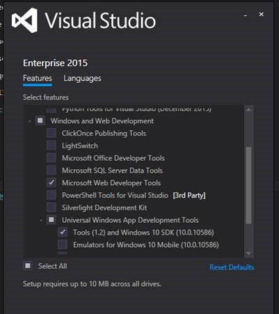
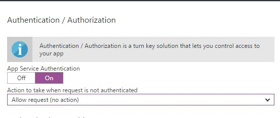
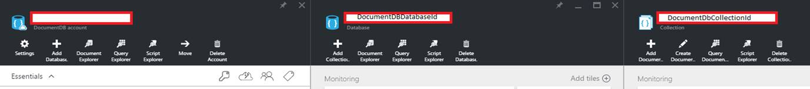

# Getting started with the **PhotoSharingApp** sample

There are two ways to explore the **PhotoSharingApp** sample:

 1. You can run the UWP app with a dummy service. This allows you to explore some basic features of the app without the need to set up the Azure service.

 2. You can set up your own Azure App Service, which will be your app backend for storing and retrieving real data.

## Pre-requisites

 1. [Visual Studio 2015](https://www.visualstudio.com/downloads/download-visual-studio-vs) with *Universal Windows App Development Tools* and *Web Developer Tools* installed. Also ensure that you have the latest updates.

 
 2. Latest [Azure SDK](https://azure.microsoft.com/en-us/downloads/).

#### Launching the app with the dummy service

The dummy service is a service implementation that loads static data into the app for exploring and testing purposes.

In Visual Studio, make sure to have *Debug* mode enabled. By default, *PhotoSharingApp.Universal* is the StartUp project, so you can Start Debugging (F5) or Start Without Debugging (Ctrl+F5) to explore the app connected to the dummy service.

**Note** : When you first load the solution, you may run into numerous warnings and errors in the Error List. This is because the NuGet packages are not downloaded and dependencies are not yet built. First *Clean* the solution and then *Build* it to get rid of all those errors.

## Setting up the Azure backend service

You need an [Azure account](https://azure.microsoft.com) to create an Azure App Service, DocumentDB, and Blob storage. If you do not have an Azure account already, you can sign up for a free one-month trial [here](https://azure.microsoft.com).

#### Create Azure Mobile App with Authentication

 1. Create an Azure Mobile App as described [here](https://azure.microsoft.com/documentation/articles/app-service-mobile-dotnet-backend-how-to-use-server-sdk/#create-app). Follow Steps 1 to 4 only, and stop after you have Clicked “Create”.
  - After the Mobile App is provisioned, you will have the mobile app URL available for use. Note this URL (it will look like *https://contoso.azurewebsites.net*).
  - Enter this URL (**use the *https* version**) for `string AzureAppServiceBaseUrl` in the file located at  [PhotoSharingApp\PhotoSharingApp.Universal\ServiceEnvironments\ServiceEnvironment.cs](PhotoSharingApp/PhotoSharingApp.Universal/ServiceEnvironments/ServiceEnvironment.cs#L25).

 2. Set up your Mobile App to accept authenticated users.
  - The **PhotoSharingApp** code sample allows user authentication via Microsoft Account, Facebook, Twitter, and Google. To experience the full functionality of the sample, enable at least one of the following authentication providers in [Azure Portal](https://portal.azure.com/) at *Mobile App -> Settings -> Authentication/Authorization*. (**Note**: Do not use *Mobile authentication* under settings).
      - [Microsoft Account configuration](https://azure.microsoft.com/documentation/articles/app-service-mobile-how-to-configure-microsoft-authentication/).
      - [Facebook configuration](https://azure.microsoft.com/documentation/articles/app-service-mobile-how-to-configure-facebook-authentication/).
      - [Twitter configuration](https://azure.microsoft.com/documentation/articles/app-service-mobile-how-to-configure-twitter-authentication/).
      - [Google configuration](https://azure.microsoft.com/documentation/articles/app-service-mobile-how-to-configure-google-authentication/).
    - When providing your mobile app URL with the authentication providers, make sure you use the **https** version.
 - Ensure that you set "Allow request (no action)" when the request is not authenticated before you click *Save*.



**Note** : Different Authentication providers have different token expiration times. Keep that in consideration if you need to refresh tokens for continued access to the authenticated service.

#### Create Azure Blob storage

 1. Create an Azure storage account following the instructions at [Create a storage account](https://azure.microsoft.com/documentation/articles/storage-create-storage-account/).
 2. Once the creation has completed, navigate to your storage account and click on *Access keys* to note the storage account name and one of the access keys. Enter these values in [PhotoSharingApp\PhotoSharingApp.AppService.Shared\Context\EnvironmentDefinition.cs](PhotoSharingApp/PhotoSharingApp.AppService.Shared/Context/EnvironmentDefinition.cs)
  - `string StorageAccountName`
  - `string StorageAccessKey`

#### Create DocumentDB account, database, and collection

 1. [Create a DocumentDB account](https://azure.microsoft.com/documentation/articles/documentdb-create-account/).
 2. After creation, collect the values below from the Azure Portal and input these values at the following locations in [PhotoSharingApp\PhotoSharingApp.AppService.Shared\Context\EnvironmentDefinition.cs](PhotoSharingApp/PhotoSharingApp.AppService.Shared/Context/EnvironmentDefinition.cs):
  - The DocumentDbStorage.EndpointUrl property setting - *DocumentDB account -> Keys -> URI* (example: *https://contoso-documentdb.documents.azure.com:443/*)
  - The DocumentDbStorage.AuthorizationKey property setting - *DocumentDB account -> Keys -> Primary Key*

The database and collection are by default created automatically by the service on startup. There are default values for database and collection identifiers already configured, but you can change these if you want to in the [EnvironmentDefinition.cs](PhotoSharingApp/PhotoSharingApp.AppService.Shared/Context/EnvironmentDefinition.cs#L25) file, and let the service to create them for you.
Or you can [create a DocumentDB database](https://azure.microsoft.com/documentation/articles/documentdb-create-database/) and [create a DocumentDB collection](https://azure.microsoft.com/documentation/articles/documentdb-create-collection/) on your own and update the DefaultEnvironmentDefinition settings with your database and collection IDs.  The service will not overwrite an existing database or collection; it creates a new one only if there is no existing one with a matching id.
  - The DocumentDbStorage.CollectionId property setting - *DocumentDB account -> Databases -> Collections*
  - The DocumentStorage.DatabaseId property setting - *DocumentDB account -> Databases*


#### Deploy service to Azure and connect the app

Download the Mobile App Service publishing profile from the Azure portal (*Get Publish Profile*). Right click on *PhotoSharingApp.AppService* project *-> Select Publish -> Profile -> Import -> Browse to the downloaded Mobile App publishing profile and select it -> Click OK -> Publish*. Refer to "How to: Publish the server project" section at this [page](https://azure.microsoft.com/documentation/articles/app-service-mobile-dotnet-backend-how-to-use-server-sdk/) for more details.

Now set the PhotoSharingApp.Universal project as StartUp Project and launch the app in Debug mode. Within the app, navigate to the Debug page from the navigation panel of the app and disable the *Use Photo Dummy Service* switch. This will enable the service which was configured earlier in [ServiceEnvironment.cs](PhotoSharingApp/PhotoSharingApp.Universal/ServiceEnvironments/ServiceEnvironment.cs).

If the app has properly connected to the service, you should see a green indicator under the Service Connection Status.  If there were any issues connecting to the service the indicator will be red, please check that you have properly followed the directions involving the service deployment. (**Note**: *If the service code is not deployed to Azure (see section Deploy service to Azure and connect the app) you may get an error since service selection defaults to your set mobile service URL by default.*)

Once published successfully, your **PhotoSharingApp** can now be used with the Azure App Service backend!

## Configure Push Notifications (Optional)

 1. Follow Steps 8 and 9 of "Register your app for the Windows Store" on this [page](https://azure.microsoft.com/documentation/articles/notification-hubs-windows-store-dotnet-get-started/) to get the Client Secret and Package SID of your **PhotoSharingApp**.
 2. Follow "Configure your notification hub" section on the same page. Enter the Client Secret and Package SID for Windows notifications settings which you obtained in the above step. **Stop** at the end of the section.
 3. Note the DefaultFullSharedAccessSignature connection string and Notification Hub name and enter them at [PhotoSharingApp\PhotoSharingApp.AppService.Shared\Context\EnvironmentDefinition.cs](PhotoSharingApp/PhotoSharingApp.AppService.Shared/Context/EnvironmentDefinition.cs#L25)
  - ```string HubName```
  - ```string HubFullSharedAccessSignature```
 4. Publish the updates to the service backend.

**Note**: After the service is updated for push notifications, you may need to re-launch the app in order to successfully subscribe to a push notification channel. Push notification registration is performed when a user has signed in successfully or on app launch (if a user is already signed in).

## Configure Application Insights (Optional)

The service has been prepared to support [Application Insights](https://azure.microsoft.com/services/application-insights/) for telemetry data.

#### Azure Mobile App Service Telemetry

When you created the Azure Mobile App as described in *Create Azure Mobile App with Authentication* section, Azure automatically created an instance of Application Insights for the backend. It is called *yourMobileAppName-azureResourceLocation*. For example, if your Mobile App is *contoso* located in *Central US* then your Application Insights instance would be called *"contoso-Central US"*. This will be located in the [Azure Portal](https://portal.azure.com) at *Application Insights*

To enable telemetry for the service, paste your Instrumentation Key found in Azure portal of your *Application Insight instance -> Settings -> Properties* into *InstrumentationKey* in [EnvironmentDefinition.cs](PhotoSharingApp/PhotoSharingApp.AppService.Shared/Context/EnvironmentDefinition.cs#L25).

## Configure IAP (In-App Product) (Optional)

**PhotoSharingApp** features the use of virtual *Gold*. The app has been set up for purchasing additional *Gold* through the Windows Store as an IAP. To enable this functionality, refer the steps below.

 1. Go to your app on [Windows Dev Center](https://dev.windows.com/)
 2. Click on *IAPs -> Create a New IAP*
 3. The product ID for the IAP is defined in [InAppPurchases.cs](PhotoSharingApp/PhotoSharingApp.Universal/Store/InAppPurchases.cs). Enter this value ("Gold" is the preset value) and click *Create IAP*  (**Note** - This value can't be changed or deleted once created.)
 4. Set the *Property -> Product Type* as a **Consumable**.
 5. Set the Pricing and Description based on your preference.
 6. Click on *Submit to Store*.

For more details around IAP submissions, refer to this [article](https://msdn.microsoft.com/en-us/windows/uwp/publish/iap-submissions).
