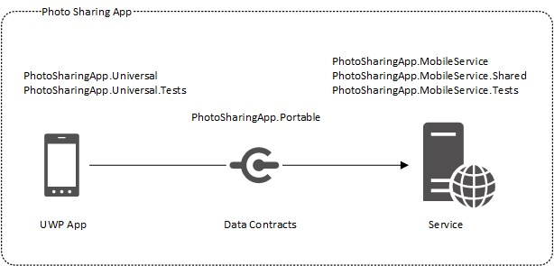

# Project overview

The **PhotoSharingApp** solution consists of two projects for the client app (PhotoSharingApp.Universal, PhotoSharingApp.Universal.Tests) and three projects for the service (PhotoSharingApp.MobileService, PhotoSharingApp.MobileService.Shared, PhotoSharingApp.MobileService.Tests). Both client and service implementations make use of a portable library which contains interfaces and shared data models for communication.

The following diagram illustrates how the app and service are separated in the project structure:

List of projects with individual notes:
- [PhotoSharingApp.Universal](PhotoSharingApp/PhotoSharingApp.Universal): The UWP (Universal Windows Platform) project that contains the app.
- [PhotoSharingApp.Universal.Tests](PhotoSharingApp/PhotoSharingApp.Universal.Tests): Contains unit tests for the UWP app
- [PhotoSharingApp.AppService](PhotoSharingApp/PhotoSharingApp.MobileService): The Azure Mobile App project
- [PhotoSharingApp.AppService.Shared](PhotoSharingApp/PhotoSharingApp.MobileService.Shared): Contains data models & data storage layer
- [PhotoSharingApp.AppService.Tests](PhotoSharingApp/PhotoSharingApp.MobileService.Tests): Contains tests for the Azure Mobile App

## PhotoSharingApp.Universal
The following namespaces exist in the UWP project:
- [Actions](PhotoSharingApp/PhotoSharingApp.Universal/Actions): Contains UI actions such as the OpenMenuFlyoutAction.cs.
- [Assets](PhotoSharingApp/PhotoSharingApp.Universal/Assets): Contains icons, app logos and image assets for the introduction screens.
- [Camera](PhotoSharingApp/PhotoSharingApp.Universal/Camera): Code that encapsulates the camera API.
- [Commands](PhotoSharingApp/PhotoSharingApp.Universal/Commands): Contains implementations of the [ICommand](https://msdn.microsoft.com/en-us/library/windows/apps/windows.ui.xaml.input.icommand.aspx) interface for binding commands to user controls.
- [ComponentModel](PhotoSharingApp/PhotoSharingApp.Universal/ComponentModel): Contains ObservableObjectBase.cs that a base class which provides an implementation of [INotifyPropertyChanged](https://msdn.microsoft.com/en-us/library/windows/apps/windows.ui.xaml.data.inotifypropertychanged.aspx) to support data binding. Also contains IncrementalLoadingCollection.cs which allows incremental loading of data using [ISupportIncrementalLoading](https://msdn.microsoft.com/en-us/library/windows/apps/windows.ui.xaml.data.isupportincrementalloading.aspx).
- [ContractModelConverterExtensions](PhotoSharingApp/PhotoSharingApp.Universal/ContractModelConverterExtensions): Extension methods that help converting between [data contracts](PhotoSharingApp/PhotoSharingApp.Portable/DataContracts) which are used for service communication and local [data models](/PhotoSharingApp/PhotoSharingApp.Universal/Models) used for data binding.
- [Controls](PhotoSharingApp/PhotoSharingApp.Universal/Controls): Contains reusable UI controls
- [Editing](PhotoSharingApp/PhotoSharingApp.Universal/Editing): Editing tools for cropping, resizing and rotating photos
- [Extensions](PhotoSharingApp/PhotoSharingApp.Universal/Extensions): Extension methods for data models and native types
- [Facades](PhotoSharingApp/PhotoSharingApp.Universal/Facades): Encapsulates in-app purchase handling & page navigation [(see Facade pattern)](https://msdn.microsoft.com/en-us/library/orm-9780596527730-01-04.aspx).
- [Lifecycle](PhotoSharingApp/PhotoSharingApp.Universal/Lifecycle): Contains code that does initial work on app launch
- [Models](PhotoSharingApp/PhotoSharingApp.Universal/Models): Contains data models (e.g. [Photo](PhotoSharingApp/PhotoSharingApp.Universal/Models/Photo.cs), [Category](PhotoSharingApp/PhotoSharingApp.Universal/Models/Category.cs), [User](PhotoSharingApp/PhotoSharingApp.Universal/Models/User.cs))
- [NavigationBar](PhotoSharingApp/PhotoSharingApp.Universal/NavigationBar): Contains all navigation bar menu items and the interface definition [INavigationBarMenuItem.cs](PhotoSharingApp/PhotoSharingApp.Universal/NavigationBar/INavigationBarMenuItem.cs)
- [Registries](PhotoSharingApp/PhotoSharingApp.Universal/Registries): Contains classes that register dependencies to the [Unity](https://msdn.microsoft.com/en-us/library/dn223671%28v=pandp.30%29.aspx) dependency container.
- [Serialization](PhotoSharingApp/PhotoSharingApp.Universal/Serialization): Helper methods for serialization and de-serialization that are used for page navigation.
- [ServiceEnvironments](PhotoSharingApp/PhotoSharingApp.Universal/ServiceEnvironments): Contains service environments that the app can connect to. The [ServiceEnvironment.cs](PhotoSharingApp/PhotoSharingApp.Universal/ServiceEnvironments/ServiceEnvironment.cs) abstraction consists of the endpoint of the Azure Mobile App as well as an instrumentation key for [Azure Application Insights](https://azure.microsoft.com/en-us/services/application-insights/).
- [Services](PhotoSharingApp/PhotoSharingApp.Universal/Services): Contains code that encapsulates communication and authentication with the service. Service communication is defined by the [IPhotoService.cs](PhotoSharingApp/PhotoSharingApp.Universal/Services/IPhotoService.cs) interface. Currently, there are two implementations of this interface, PhotoDummyService.cs (which provides static dummy data for testing purposes) and ServiceClient.cs (which connects to a running Azure Mobile App)
- [Settings](PhotoSharingApp/PhotoSharingApp.Universal/Settings): Contains code for storing and loading app settings.
- [StateTriggers](PhotoSharingApp/PhotoSharingApp.Universal/StateTriggers): Additional UI state triggers that derive from [StateTriggerBase](https://msdn.microsoft.com/en-us/library/windows/apps/windows.ui.xaml.statetriggerbase.aspx).
- [Storage](PhotoSharingApp/PhotoSharingApp.Universal/Storage): Contains helper code for file pickers.
- [Store](PhotoSharingApp/PhotoSharingApp.Universal/Store): Contains a proxy class for CurrentApp and other helper classes which allow simulating in-app purchases at runtime.
- [Strings](PhotoSharingApp/PhotoSharingApp.Universal/Strings): String resources
- [Styles](PhotoSharingApp/PhotoSharingApp.Universal/Styles): ResourceDictionary with styles, templates and color presets.
- [Telemetry](PhotoSharingApp/PhotoSharingApp.Universal/Telemetry): Central place for events and parameters for [Azure Application Insights](https://azure.microsoft.com/en-us/services/application-insights/) telemetry
- [Unity](PhotoSharingApp/PhotoSharingApp.Universal/Unity): Contains the UnityBootstrapper.cs for initializing the Unity dependency container and some other helpers for [Unity](https://msdn.microsoft.com/en-us/library/dn223671%28v=pandp.30%29.aspx).
- [ValueConverters](PhotoSharingApp/PhotoSharingApp.Universal/ValueConverters): Class implementations for [IValueConverter](https://msdn.microsoft.com/en-us/library/windows/apps/windows.ui.xaml.data.ivalueconverter.aspx).
- [ViewModels](PhotoSharingApp/PhotoSharingApp.Universal/ViewModels): Contains ViewModel classes based on the [MVVM](https://msdn.microsoft.com/en-us/library/hh848246.aspx) pattern
- [ViewModels.Design](PhotoSharingApp/PhotoSharingApp.Universal/ViewModels/Design): Design-time ViewModels that provide static data for design purposes. This allows to preview the UI filled with test data without having the app running.
- [Views](PhotoSharingApp/PhotoSharingApp.Universal/Views): Contains UI pages, such as [CategoriesPage.xaml](PhotoSharingApp/PhotoSharingApp.Universal/Views/CategoriesPage.xaml), [StreamPage.xaml](PhotoSharingApp/PhotoSharingApp.Universal/Views/StreamPage.xaml) or [PhotoDetailsPage.xaml](PhotoSharingApp/PhotoSharingApp.Universal/Views/PPhotoDetailsPage.xaml).
- [App.xaml.cs](PhotoSharingApp/PhotoSharingApp.Universal/App.xaml.xs): App entry point
- [AppShareTarget.cs](PhotoSharingApp/PhotoSharingApp.Universal/AppShareTarget.cs): App entry point when used as share target

## PhotoSharingApp.Universal.Tests

This test project contains unit tests for code in the PhotoSharingApp.Universal project. Test classes are located in equivalent namespaces as the code that is tested.

## PhotoSharingApp.Portable
- [DataContracts](PhotoSharingApp/PhotoSharingApp.Portable/DataContracts): Contains data contracts that are being used for communication between the app and service
- [Extensions](PhotoSharingApp/PhotoSharingApp.Portable/Extensions): Extension methods for data contracts

## PhotoSharingApp.AppService
- [Controllers](PhotoSharingApp/PhotoSharingApp.AppService/Controllers): ApiControllers that handle service requests
- [Models](PhotoSharingApp/PhotoSharingApp.AppService/Models): NotificationsHubModel.cs helper class
- [Helpers](PhotoSharingApp/PhotoSharingApp.AppService/Helpers): Contains user validation helpers
- [Notifications](PhotoSharingApp/PhotoSharingApp.AppService/Notifications): NotificationHandler.cs that handles push notifications
- [ServiceCore](PhotoSharingApp/PhotoSharingApp.AppService/ServiceCore): Helper classes for exception handling

## PhotoSharingApp.AppService.Shared
- [Context](PhotoSharingApp/PhotoSharingApp.AppService.Shared/Context): Service environment definitions
- [Models](PhotoSharingApp/PhotoSharingApp.AppService.Shared/Models): DocumentDB models
- [Repositories](PhotoSharingApp/PhotoSharingApp.AppService.Shared/Repositories): The repository interface definition and implementations
- [Validation](PhotoSharingApp/PhotoSharingApp.AppService.Shared/Validation): Helper classes for data model and in-app purchase validation

## PhotoSharingApp.AppService.Tests

This test project contains unit tests for code in the PhotoSharingApp.AppService project. Test classes are located in equivalent namespaces as the code that is tested.
