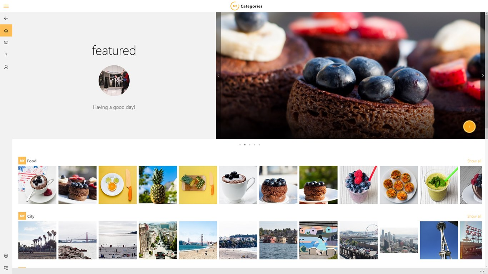

# Appsample-Photosharing

**PhotoSharingApp** is a Universal Windows Platform (UWP) app sample that showcases a real-world photo sharing app.

With the photo sharing app sample you earn virtual gold by uploading and sharing photos with people from all around the world. Upload photos about your cat, shoes, house or last vacation, and see how you compete against other users: Are your photos a great gold source? Are you among the most generous contributors? Find it out!

The goal of this sample code is to provide a complete end-to-end example of a real-world app. This app makes use of a variety of UWP features and app development best practices, so that it can be a great source for borrowing code pieces and getting an example of what the architecture of a real-world app might look like. The decoupled architecture makes it easy to borrow code pieces or integrate modifications to build your own photo sharing app with a few modifications that you can publish in the [Windows Store](http://dev.windows.com)! We'd like to hear your app ideas and where you think it might go next!



Application Screenshots:
- Categories Page [Desktop](Images/Category-Overview-Desktop.jpg "The photo sharing app") [Mobile](Images/Category-Overview-Mobile.jpg "The photo sharing app")
- Photo Stream [Desktop](Images/PhotoStream-Desktop.jpg) [Mobile](Images/PhotoStream-Mobile.jpg)
- Photo Details Page [Desktop](Images/PhotoDetailsPage-Desktop.jpg) [Mobile](Images/PhotoDetailsPage-Mobile.jpg)
- Profile Page [Desktop](Images/ProfilePage-Desktop.jpg) [Mobile](Images/ProfilePage-Mobile.jpg)

## App features

The app allows users to:
- Browse photo categories, navigate into photo streams and photo details
- Take and upload photos directly in **PhotoSharingApp** or upload an existing photo
- Give gold and add comments to photos uploaded by other users
- Explore leaderboard of users with most gold, users that have given most gold to other photos, and the photos that have received the highest amount of gold
- Sign in with a Microsoft, Facebook, Google or Twitter account.
- Report content as abusive, inappropriate or spam.
- Receive push notifications when gold is being received for uploaded photos
- Buy virtual gold using in-app purchase

## Technology overview
**PhotoSharingApp** combines the following technical aspects in the sample app:
- Adaptable UI using the new [SplitView](https://msdn.microsoft.com/library/windows/apps/windows.ui.xaml.controls.splitview.aspx) ([Video on Channel 9](https://channel9.msdn.com/Shows/Inside-Windows-Platform/UWP-Layout-using-SplitView-and-RelativePanel-in-C-with-XAML)) and [adaptive triggers](https://msdn.microsoft.com/en-uS/office/office365/windows.ui.xaml.adaptivetrigger.aspx):

    > [PhotoSharingApp.Universal.AppShell.xaml](PhotoSharingApp/PhotoSharingApp.Universal/AppShell.xaml)
- In-app purchase ([Windows.ApplicationModel.Store](https://msdn.microsoft.com/library/windows/apps/windows.applicationmodel.store.aspx)):

    > [Purchase virtual gold](TechnicalDeepDive.md#in-app-purchase), [PhotoSharingApp.Universal.Store](PhotoSharingApp/PhotoSharingApp.Universal/Store)

- Separation between user interface, business logic, data models ([MVVM](https://msdn.microsoft.com/en-us/library/hh848246.aspx)):

    > [PhotoSharingApp.Universal.Models](PhotoSharingApp/PhotoSharingApp.Universal/Models),
    [PhotoSharingApp.Universal.Views](PhotoSharingApp/PhotoSharingApp.Universal/Views),  [PhotoSharingApp.Universal.ViewModels](PhotoSharingApp/PhotoSharingApp.Universal/ViewModels)

- Extensibility and flexibility using the [Unity](https://msdn.microsoft.com/en-us/library/dn223671%28v=pandp.30%29.aspx) dependency container:

    > [PhotoSharingApp.Universal.Unity](PhotoSharingApp/PhotoSharingApp.Universal.Unity), [PhotoSharingApp.Universal.Registries](PhotoSharingApp/PhotoSharingApp.Universal.Registries)

- How to connect your app to an [Azure App Service](https://azure.microsoft.com/en-us/documentation/articles/app-service-value-prop-what-is/)

    > [PhotoSharingApp.Universal.Services.ServiceClient.cs](PhotoSharingApp/PhotoSharingApp.Universal.Services/ServiceClient.cs)

- Real-world service implementation for storing uploaded photos using [Azure DocumentDB](https://azure.microsoft.com/en-us/documentation/articles/documentdb-introduction/)
- [Sign-in](https://azure.microsoft.com/en-us/documentation/articles/app-service-mobile-auth/) with Azure Mobile Apps:

    > [PhotoSharingApp.AppService.Shared.Repositories.DocumentDbRepository.cs](PhotoSharingApp/PhotoSharingApp.AppService.Shared.Repositories/DocumentDbRepository.cs)

- Usage analysis with [Azure Application Insights](https://azure.microsoft.com/en-us/services/application-insights/)

    > [PhotoSharingApp.Universal.ViewModels.UploadViewModel.cs](PhotoSharingApp/PhotoSharingApp.Universal.ViewModels/UploadeViewModel.cs)

- [Push Notifications](https://azure.microsoft.com/en-us/documentation/articles/notification-hubs-overview/#integration-with-app-service-mobile-apps):

    > [PhotoSharingApp.Universal.Services.NotificationRegistrationClient](PhotoSharingApp/PhotoSharingApp.Universal.Services/NotificationRegistrationClient.cs)

## Running the sample
There are two ways to explore the **PhotoSharingApp** sample.
You can run the UWP app with a dummy service without the need to set up the service in Azure, which allows you to explore some basic features of the app.

The other option is to set up your own Azure App Service which will be your app backend for storing and retrieving real data.

#### Launching the app with the dummy service

The dummy service is a service implementation that loads static data into the app for exploring and testing purposes.

In Visual Studio, make sure to have *Debug* mode enabled. By default, *PhotoSharingApp.Universal* is the StartUp project, so you can Start Debugging (F5) or Start Without Debugging (Ctrl+F5) to explore the app connected to the dummy service.

## Setting up the Azure backend service

You need an [Azure account](https://azure.microsoft.com) to create an Azure App Service, DocumentDB and Blob storage. If you do not have an Azure account already, you can sign up for a free one-month trial [here](https://azure.microsoft.com).

#### Create Azure Mobile App with Authentication

1. Create an Azure Mobile App as described [here](https://azure.microsoft.com/en-us/documentation/articles/app-service-mobile-dotnet-backend-how-to-use-server-sdk/#create-app).
  - Follow Steps 1 to 4 only. Stop after you have Clicked “Create”.
  - After the Mobile App is provisioned, you will have the mobile app URL available for use. Note this URL (e.g. *https://contoso.azurewebsites.net*).
  - Enter this URL for `string AzureAppServiceBaseUrl` in the file located at  *[PhotoSharingApp/PhotoSharingApp.Universal/ServiceEnvironments/ProdServiceEnvironment.cs]*

2. Set up your Mobile App to accept authenticated users.
  - The **PhotoSharingApp** code sample allows users to be authenticated via Microsoft Account, Facebook, Twitter and Google. To experience the full functionality of the sample, enable at least 1 means of authentication on the *Mobile App -> Settings -> Authentication/Authorization*. (**Note**: Do not use *Mobile authentication* under settings).
      - [Microsoft Account configuration](https://azure.microsoft.com/en-us/documentation/articles/app-service-mobile-how-to-configure-microsoft-authentication/).
      - [Facebook configuration](https://azure.microsoft.com/en-us/documentation/articles/app-service-mobile-how-to-configure-facebook-authentication/).
      - [Twitter configuration](https://azure.microsoft.com/en-us/documentation/articles/app-service-mobile-how-to-configure-twitter-authentication/).
      - [Google configuration](https://azure.microsoft.com/en-us/documentation/articles/app-service-mobile-how-to-configure-google-authentication/).
 - Ensure that you set "Allow request (no action)" when the request is not authenticated.
 

#### Create Azure Blob storage
1. Create an Azure storage account following instructions under [Create a storage account](https://azure.microsoft.com/en-us/documentation/articles/storage-create-storage-account/).
2. In the above link navigate to "View and copy storage access keys" section and note the Storage Account Name and one of the Access Keys and enter these values in the file located at  *[PhotoSharingApp/PhotoSharingApp.AppService.Shared/Context/ProdEnvironmentDefinition.cs]*
  - ```string StorageAccountName```
  - ```string StorageAccessKey```

#### Create DocumentDB account, database and collection

1. [Create a DocumentDB account](https://azure.microsoft.com/en-us/documentation/articles/documentdb-create-account/).
2. After creation, collect the values below from the Azure Portal and input these values at *[PhotoSharingApp/PhotoSharingApp.AppService.Shared/Context/DefaultEnvironmentDefinition.cs]*
  - ```string DocumentDbEndpointUrl``` - *DocumentDB account -> Keys -> URI* (e.g. *https://contoso-documentdb.documents.azure.com:443/*)
  - ```string DocumentDbAuthorizationKey``` - *DocumentDB account -> Keys -> Primary Key*

The DocumentDB client is able to programatically create databases and collections, and when the service starts up it will create these for you.  There are default values already configured for your DocuementDB database and collection, you can change these if you want in the DefaultEnvironmentDefinition file and allow the service to create them for you.
Or you can [create a DocumentDB database](https://azure.microsoft.com/en-us/documentation/articles/documentdb-create-database/) and [create a DocumentDB collection](https://azure.microsoft.com/en-us/documentation/articles/documentdb-create-collection/) on your own and update the DefaultEnvironmentDefinition with your database and collection ids.  The service will not overwrite an existing database or collection, it only creates a new one if one with a matching id doesn't exist.
  - ```string DocumentDbCollectionId``` – *DocumentDB account -> Databases -> Collections*
  - ```string DocumentDbDatabaseId``` – *DocumentDB account -> Databases*


#### Create NotificationHub for Push Notifications.

1. Grab the Client Secret and Package SID for your **PhotoSharingApp** from the [Windows Dev Center](https://dev.windows.com/).
2. Follow “Configure your notification hub” section [here](https://azure.microsoft.com/en-us/documentation/articles/notification-hubs-windows-store-dotnet-get-started/). Enter the Client Secret and Package SID for Windows notifications settings.
3. Note the DefaultFullSharedAccessSignature connection string and Notification Hub name and enter them at *[PhotoSharingApp/PhotoSharingApp.AppService.Shared/Context/ProdEnvironmentDefinition.cs]*
  - ```string NotificationHubName```
  - ```string NotificationHubFullSharedAccessSignature```

##### Test app service locally

In Visual Studio, right-click on the PhotoSharingApp.AppService.Shared project and select *Set as StartUp Project*. Press *Ctrl+F5* or select *Debug* > *Start Without Debugging* to start the App Service locally.

Now set the project *PhotoSharingApp.Universal* as *StartUp Project* and launch the app in *Debug* mode. Within the app, navigate to the *Debug* page, disable the *Use Photo Dummy Service* switch and select *http://localhost:XXXX/* as service endpoint from the dropdown list to test the connection with the service.

If the app has properly connected to the service, you should see a green indicator under the Service Connection Status.  If there were any issues connecting to the service the indicator will be red, please check that you have properly followed the directions involving the service deployment.

#### Deploy service to Azure and connect the app

Download the Mobile App Service publishing profile from the Azure portal. Right click on *PhotoSharingApp.AppService* project *-> Select Publish -> Profile -> Import -> Browse to the downloaded Mobile App publishing profile and select it -> Click OK -> Publish*. Refer to “How to: Publish the server project” section at this [page](https://azure.microsoft.com/en-us/documentation/articles/app-service-mobile-dotnet-backend-how-to-use-server-sdk/) for more details.

Once published successfully, your **PhotoSharingApp** can now be used with the Azure App Service backend!

#### Application Insights

Both service and app have been prepared to support Application Insights for telemetry data.

Depending on if you want both app and service to send telemetry or one of the projects only, you will need to create one or two instances of Application Insights in Azure:
- Go to [Azure Portal](https://portal.azure.com/#create/Microsoft.AppInsights)
- Select *Windows Store Application* and enter a name for the Application Insights instance.
- Go ahead and create the instance and copy the instrumentation key

To enable the app to send telemetry to the Application Insights instance you just created, you need to paste the instrumentation key into *InstrumentationKey* of your environment definition (by default DevEnvironmentDefinition.cs).

To enable Application Insights in the service, paste your instrumentation key into *instrumentationKeyProd* in Web.config.

## Project overview

For an overview of the projects structure and namespaces, visit the guidance on [Project overview](ProjectOverview.md).

## Technical deep dive
The [*Technical deep dive*](TechnicalDeepDive.md) site explains what technologies the app sample uses and how those are integrated.
