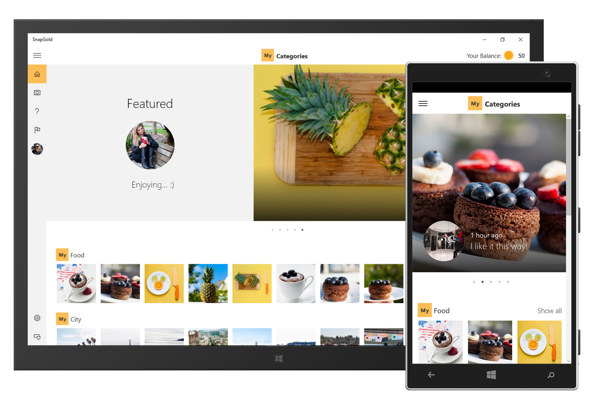

# Appsample-Photosharing

**PhotoSharingApp** is a Universal Windows Platform (UWP) app sample that demonstrates real-world social media experiences around photo sharing.

With this app, users can earn virtual gold by uploading and sharing photos with people from all around the world. They can upload photos of their cats, shoes, houses, or last vacations, and see how they compete against other users. Are their photos a great gold source? Are they among the most generous contributors? They can find out on the app's leaderboard.

The goal of this app is to provide a complete, end-to-end example of a real-world app that uses a variety of UWP features, and exhibits design and development best practices. This makes it a great source of code you can copy into your own apps. It also provides an example of what a real-world app architecture might look like. The decoupled architecture makes it easy to reuse code or to make changes and build your own photo sharing app, which you can then publish in the [Windows Store](http://dev.windows.com).

Application Screenshots:

- Categories Page [Desktop](Images/Category-Overview-Desktop.jpg) [Mobile](Images/Category-Overview-Mobile.jpg)
- Photo Stream [Desktop](Images/PhotoStream-Desktop.jpg) [Mobile](Images/PhotoStream-Mobile.jpg)
- Photo Details Page [Desktop](Images/PhotoDetailsPage-Desktop.jpg) [Mobile](Images/PhotoDetailsPage-Mobile.jpg)
- Profile Page [Desktop](Images/ProfilePage-Desktop.jpg) [Mobile](Images/ProfilePage-Mobile.jpg)

## App features

The app allows users to:
- Browse photo categories and navigate into photo collections and photo details.
- Take and upload photos directly in the app or upload an existing photo.
- Give gold and add comments to photos uploaded by other users.
- Receive push notifications when they they are given gold for uploaded photos.
- Explore a leaderboard of users with the most gold, users that have given the most gold to other photos, and the photos that have received the most gold.
- Sign in with a Microsoft, Facebook, Google, or Twitter account.
- Report content as abusive, inappropriate, or spam.
- Buy virtual gold using in-app purchase.

## Technology overview

**PhotoSharingApp** demonstrates the following features:

- Adaptive UI using the [SplitView](https://msdn.microsoft.com/library/windows/apps/windows.ui.xaml.controls.splitview.aspx) control ([see video on Channel 9](https://channel9.msdn.com/Shows/Inside-Windows-Platform/UWP-Layout-using-SplitView-and-RelativePanel-in-C-with-XAML)) and [adaptive triggers](https://msdn.microsoft.com/library/windows/apps/windows.ui.xaml.adaptivetrigger.aspx):

    > [PhotoSharingApp.Universal.AppShell.xaml](PhotoSharingApp/PhotoSharingApp.Universal/Views/AppShell.xaml#L23)

- In-app purchase (see the [Windows.ApplicationModel.Store](https://msdn.microsoft.com/library/windows/apps/windows.applicationmodel.store.aspx) namespace):

    > [Purchase virtual gold](TechnicalDeepDive.md#in-app-purchase), [PhotoSharingApp.Universal.Store](PhotoSharingApp/PhotoSharingApp.Universal/Store)

- Separation between user interface, business logic and data models ([MVVM](https://msdn.microsoft.com/library/hh848246.aspx)):

    > [PhotoSharingApp.Universal.Models](PhotoSharingApp/PhotoSharingApp.Universal/Models),
    [PhotoSharingApp.Universal.Views](PhotoSharingApp/PhotoSharingApp.Universal/Views),  [PhotoSharingApp.Universal.ViewModels](PhotoSharingApp/PhotoSharingApp.Universal/ViewModels)

- Extensibility and flexibility using the [Unity](https://msdn.microsoft.com/library/dn223671%28v=pandp.30%29.aspx) dependency container:

    > [PhotoSharingApp.Universal.Unity](PhotoSharingApp/PhotoSharingApp.Universal/Unity), [PhotoSharingApp.Universal.Registries](PhotoSharingApp/PhotoSharingApp.Universal/Registries)

- How to connect your app to an [Azure App Service](https://azure.microsoft.com/documentation/articles/app-service-value-prop-what-is/)

    > [PhotoSharingApp.Universal.Services.ServiceClient](PhotoSharingApp/PhotoSharingApp.Universal/Services/ServiceClient.cs#L25)

- Real-world service implementation for storing uploaded photos using [Azure DocumentDB](https://azure.microsoft.com/documentation/articles/documentdb-introduction/)

- [Sign-in](https://azure.microsoft.com/documentation/articles/app-service-mobile-auth/) with Azure Mobile Apps:

    > [PhotoSharingApp.AppService.Shared.Repositories.DocumentDbRepository](PhotoSharingApp/PhotoSharingApp.AppService.Shared/Repositories/DocumentDbRepository.cs#L25)

- Usage analysis with [Visual Studio Application Insights](https://azure.microsoft.com/services/application-insights/)

    > [PhotoSharingApp.Universal.ViewModels.UploadViewModel](PhotoSharingApp/PhotoSharingApp.Universal/ViewModels/UploadViewModel.cs)

- Push Notifications (see [Integration with App Service Mobile Apps](https://azure.microsoft.com/documentation/articles/notification-hubs-overview/#integration-with-app-service-mobile-apps) in [Azure Notification Hubs](https://azure.microsoft.com/documentation/articles/notification-hubs-overview):

    > [PhotoSharingApp.Universal.Services.NotificationRegistrationClient](PhotoSharingApp/PhotoSharingApp.Universal/Services/NotificationRegistrationClient.cs#L25)

## Running the sample

For instructions on setting up the sample, see [Getting Started](GettingStarted.md).

## Project overview

For an overview of the projects structure and namespaces, see [Project overview](ProjectOverview.md).

## Technical deep dive

For an explanation of how the sample integrates multiple technologies, see [Technical deep dive](TechnicalDeepDive.md).
